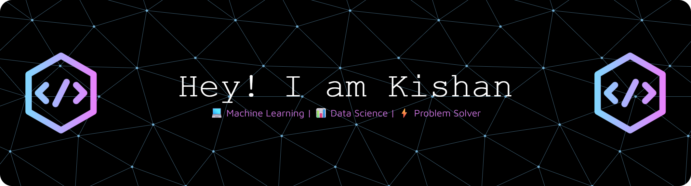

<!--Banner-->

<!--Start Intro-->               

I am a Full Stack Developer and Machine Learning Enthusiast with a huge love for Python, React.js, Node.js, Django, RDBMS, REST API and Data Visualization. 

- ✨ Student of life :)
- 🌱 I’m currently learning many things, I believe that everyday is a learning opportunity.
- 💁‍♂️ Trusted member and Moderator at [DEV Community](https://dev.to)
- 🏙 A lifetime insider and Mentor at [Exercism](https://exercism.org/profiles/Kiran1689).
- ✍ I write technical blogs, You can visit my blog site at [DEV](https://dev.to/dev_kiran).
- ❤ Contributing to Open Source.
- 💻 Visit my [Portfolio](https://kiran1689.github.io) for more details about me.
<!--End Intro-->

<!-- Contribution Graph -->
<h2 align="center">📈 Contribution Graph 📈</h2>

  

<!-- Contact Section -->
<h2 align="center">🤝 Let's Connect 🤝</h2>

  
  
  
  
  

